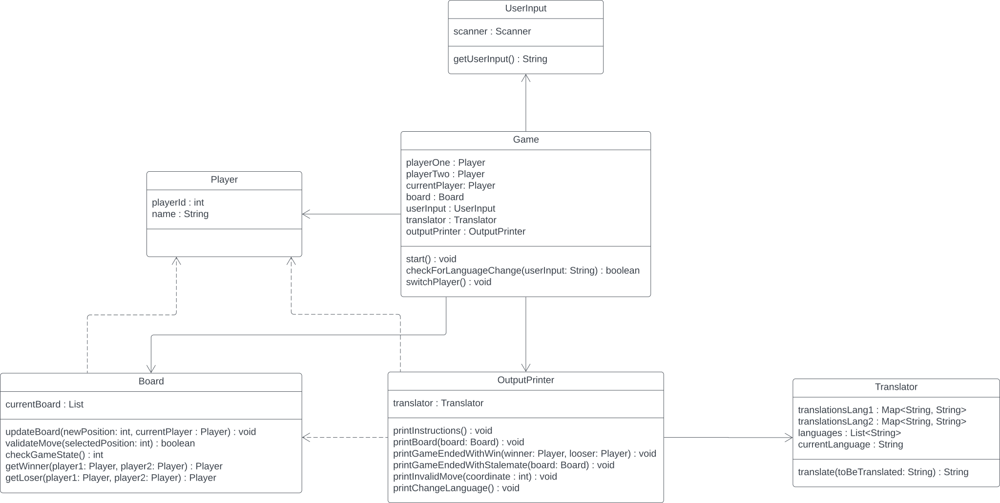

# Klassenmodell

## Game

Die Klasse Game übernimmt die "Organisation" des Spiels von hier aus wird alles gesteuert. 
### Interaktion mit anderen Klassen
Game interagiert mit den Klassen: Player, Board, UserInput und OutputPrinter.
- Player:         Abfrage und verwalten für Spielervariabeln
- Board:          Ansteuerung des Spielfeldes
- UserInput:      Abfrage der Eingabe über Klasse UserInput
- OutputPrinter:  Delegierung der Konsolenausgabe

## Player

Die Klasse Player speichert die wichtigsten Angaben der jeweiligen Spieler, damit diese an einem Ort gespeichert sind. 
### Interaktion mit anderen Klassen
Interagiert mit keiner anderen Klasse. wird lediglich aufgerufen.

## Board

Die Klasse Board verwalted das Spielfeld, sie speichert den aktuellen Stand des Spiels und überprüft auch die Spielzüge auf legalität sowie ob das Spiel gewonnen wurde oder ob es ein Unentschieden wurde. 
#### Interaktion mit anderen Klassen
Interagiert mit der Klasse Player.
- Player: Abfrage der SpielerID für Zug-Zuweisung

## Translator

Der Translator übernimmt das reinen übersetzten der Outputs. Ebenso speichert er die aktuelle Sprache. 
### Interaktion mit anderen Klassen
Interagiert mit keiner anderen Klasse. wird lediglich aufgerufen. 

## UserInput

Die Klasse UserInput ist die Schnittstelle zwischen dem Spiel und den Usern. 
### Interaktion mit anderen Klassen
Interagiert mit keiner anderen Klasse. wird lediglich aufgerufen.

## OutputPrinter

Der OutputPrinter ist das Gegenstück vom UserInput er ist für alles zuständig was angezeigt werden soll, also das was der User sieht. 
### Interaktion mit anderen Klassen
OutputPrinter interagiert mit den Klassen: Player, Board und Translator.
- Player:     Abfrage des Spieler-Namens für Ausgabe
- Board:      Abfrage des aktuellen Spielstandes für Ausgabe
- Translator: Abfrage für korrekte Sprachausgabe

# Klassendiagramm

